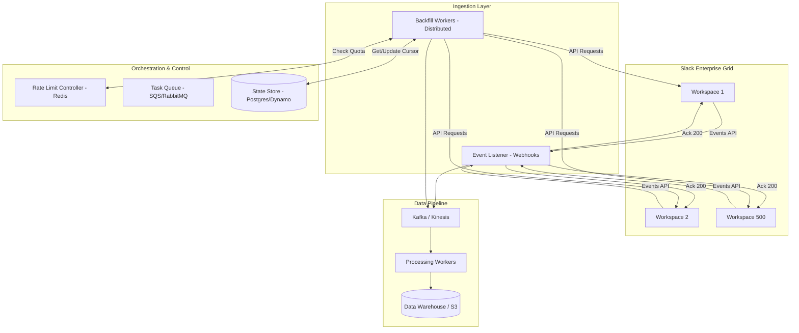

# BigData Ingestion
Goal : To design a system that ingests data from 500 enterprise Slack workspaces (millions of messages each), you must balance massive scale with strict compliance to Slack's Tiered Rate Limits.

## High-Level Architecture
The system follows an event-driven, distributed worker pattern to decouple the "discovery" of data from the "ingestion" and "processing."
* Discovery Layer: Orchestrates which channels and users need to be synced.
* Ingestion Layer (The Workers): Distributed fleet of workers that fetch data via Slack’s Web API (History) and receive data via Events API (Real-time).
* Rate Limit Controller: A centralized service (using Redis) to track and enforce "Quota" across all 500 workspaces.
* Persistence Layer: A scalable message bus (Kafka) leading to a long-term data store (BigQuery or S3/Snowflake).


## Rate Limitter
Slack applies limits per [App + Workspace + Method]. With 500 workspaces, you are effectively managing 500 independent "buckets" of rate limits.
* Token Bucket Algorithm: Use a centralized Redis store to implement a token bucket for each workspace.
* Retry-After Header: Workers must be programmed to respect the Retry-After HTTP header. If a worker hits a 429 error, it should back off and put the task back into a "Delayed Queue" in Redis/SQS.
* Tiered Handling: * Tier 3/4 methods (e.g., conversations.history) allow ~50–100+ requests/min.
    * Tier 1 methods (e.g., users.info) are much stricter. Your system must prioritize message fetching over metadata lookups.
```mermaid
sequenceDiagram
    participant W as Backfill Worker
    participant R as Redis (Token Bucket)
    participant S as Slack API
    participant Q as Delay Queue

    W->>R: Get Token (Workspace_ID, Method_Tier)
    alt Token Available
        R-->>W: Token Granted
        W->>S: API Call (conversations.history)
        S-->>W: 200 OK + Data
        W->>W: Process Data
    else Token Empty (Rate Limited)
        R-->>W: Token Denied (Wait 10s)
        W->>Q: Re-queue Task with Delay
    else 429 Received (Unexpected)
        S-->>W: 429 Too Many Requests
        W->>R: Update Bucket to "Locked"
        W->>Q: Re-queue Task (Backoff)
    end
````

## Historical Backfill
You cannot fetch millions of messages at once.
* Recursive Decomposition: Break the problem down: Workspace $\rightarrow$ Public/Private Channels $\rightarrow$ Time Segments (e.g., 1-week chunks).
* Pagination: Use cursor-based pagination. Store the next_cursor in a state database (PostgreSQL/DynamoDB) so if a worker crashes, it can resume exactly where it left off.
* Priority Queue: New workspaces should get "High Priority" workers to fetch the last 30 days of data immediately, while "Low Priority" workers backfill years of history in the background.

```mermaid
stateDiagram-v2
    [*] --> DiscoverChannels: OAuth Completed
    DiscoverChannels --> Prioritize: List All Channels
    
    state Prioritize {
        [*] --> HighPriority: Last 30 Days
        [*] --> LowPriority: 30+ Days Older
    }

    HighPriority --> FetchChunk: Use Cursor
    LowPriority --> FetchChunk: Use Cursor

    state FetchChunk {
        [*] --> CallAPI
        CallAPI --> ProcessData: Status 200
        ProcessData --> UpdateCursor: Save to DB
        UpdateCursor --> CallAPI: Has next_cursor?
        UpdateCursor --> [*]: Cursor Null (Done)
    }

    FetchChunk --> ErrorHandler: 429 or Timeout
    ErrorHandler --> FetchChunk: Exponential Backoff
````

## Real-Time Sync
Once the backfill is caught up, switch to an event-driven model.
* Webhook Endpoints: Set up a Load Balancer (ALB) behind which sits a fleet of lightweight Go/Node.js listeners.
* Immediate Acknowledge: Slack requires an HTTP 200 response within 3 seconds. The listener should simply validate the event and push the raw JSON into Kafka, then return 200 immediately. Do not process the message in the listener.
* Deduplication: Slack may send the same event twice. Use a X-Slack-Retry-Num header check or a Bloom filter in Redis to ignore duplicates.

# Handling Enterprise Complexity
Since these are Enterprise Grid workspaces, there are specific technical hurdles:
* Shared Channels (Slack Connect): Messages from Workspace A might appear in Workspace B. Your system must recognize channel_id across workspaces to avoid double-counting or data silos.
* Discovery API: For Enterprise Grid, use the Discovery APIs (available to select partners) which have higher rate limits and are specifically designed for e-discovery and archival.

# Scalability & Reliability
* Idempotency: Ensure that processing a message twice results in the same state in your database. This is critical for handling retries after rate-limit hits.
* Isolation: If one workspace (e.g., a massive 50k-person org) hits its rate limit, it should not "starve" the workers assigned to the other 499 workspaces. Use Consumer Groups in Kafka per workspace or "Virtual Shards."

# Component Selection
| Component | Technology | Why? |
|---|---|---|
|Task Queue	| RabbitMQ / AWS SQS | Handles retries and delayed execution for rate-limited tasks. |
| State Store | DynamoDB / Postgres | Tracks "Last Synced Timestamp" and "Pagination Cursors." |
| Rate Limiter | Redis (Fixed Window) | Centralized tracking of API credits per workspace. |
| Message Bus | Apache Kafka | Decouples ingestion from heavy processing/indexing. |

# The "Dead Letter & Retry" Flow
If a worker hits an error (e.g., your database is down), it shouldn't just sit there retrying the same message and blocking the whole partition. It should "move" the problem elsewhere.
* **Main Pipeline**: Consumer 1 reads a message. If it saves successfully, it commits the offset and moves to the next message.
* **Retry Topic**: If it fails (transient error), the message is sent to a Retry Topic. Consumer 1 then commits the original offset and moves on. This keeps the "lane" moving for other Slack workspaces in that partition.
* **Dead Letter Queue (DLQ)**: If the message fails 3+ times in the Retry Topic, it goes to the DLQ for a human to investigate (e.g., "This message has a weird character encoding that crashes our parser").

```mermaid
graph TD
    subgraph "Main Pipeline"
        P1[Partition 1] --> C1[Consumer 1]
        C1 --> DB[(Main Database)]
    end

    subgraph "Error Handling"
        C1 -- "Processing Failed" --> RT[Retry Topic / SQS]
        RT --> RC[Retry Consumer]
        RC -- "Retry after Delay" --> DB
        RC -- "Fatal Error" --> DLQ[Dead Letter Queue]
    end

    style P1 fill:#f9f,stroke:#333
    style RT fill:#fff4dd,stroke:#d4a017
    style DLQ fill:#f66,stroke:#900
```

