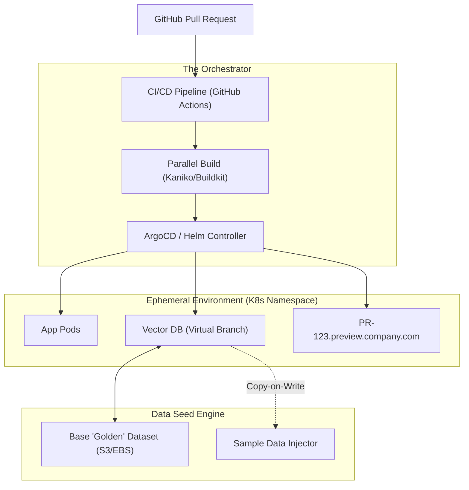
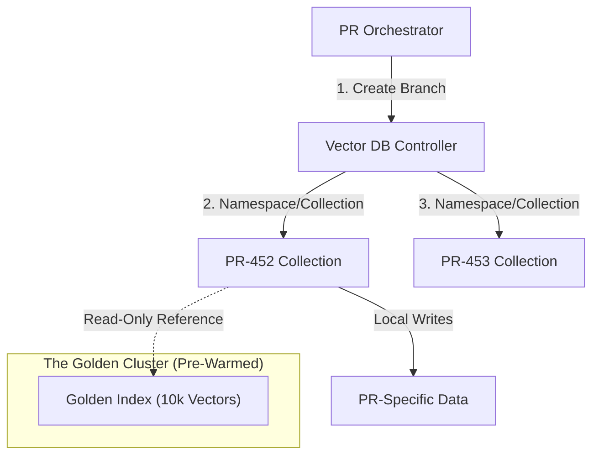
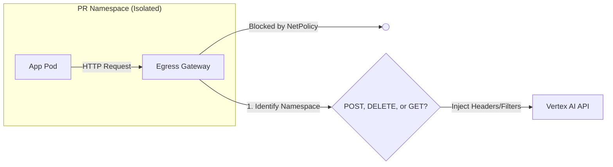

# Preview Environments
## Problem Statement
Allow engineers or stakeholders to spin up a fully functional RAG environment in < 3 minutes, using a sample vector dataset, without touching production systems.

## The Strategy: "Shift-Left" Infrastructure
To achieve < 3 minutes, you must follow these three pillars:
*Logical Isolation (Namespaces)*
* Don't create new clusters or VPCs. Deploy the PR into a dedicated Namespace in a "Preview" K8s cluster.
* Benefits:
    * Avoids creating new clusters or VPCs → saves provisioning time.
    * Provides isolated compute, networking, and secrets per preview.
    * Easy cleanup once the preview is done.
* Implementation Insight:
    * Use Resource Quotas & Network Policies per namespace.
    * Shared underlying infrastructure ensures fast startup and low cost.
*Virtual Databases* 
* Don't "restore" a 5GB Vector DB from a snapshot. 
* Use a Thin Clone or a specialized service like Neon (for Postgres) or Weaviate/Pinecone (with filtered namespaces) that allows "instant" branching of data.
* Solution: Use thin clones or branchable data services.
* Postgres/Neon: Instant branching of DB snapshots.
* Vector DBs (Weaviate, Pinecone): Filtered namespaces or temporary clones.
* Benefit:
    * The preview environment sees a full dataset immediately.
    * No long snapshot restores → achieves the sub-3-minute target.
**Pre-Warmed Images**
* Use a Local Container Registry inside the K8s cluster to avoid pulling heavy LLM/App images over the public internet.

# Architecture

## Key Principles:
* All preview environments are ephemeral, isolated, and resource-efficient.
* No extra infra beyond what’s already in the preview cluster.
* Users can test RAG functionality with sample vector datasets instantly.

## User Experience
* Developer opens a PR → triggers a preview environment.
* Preview spins up in < 3 minutes:
    * Namespace deployed
    * DB thin clone ready
    * LLM containers running
* Interactive RAG testing starts:
    * Query sample vector dataset
    * See results instantly
* Preview destroyed after PR merge or expiration.

# Golden Image or Pre-Indexed dataset
The "Golden Image": Keep a "Pre-Indexed" small dataset (10k relevant vectors) as a snapshot. When the PR starts, you use a Copy-on-Write filesystem (like ZFS or specialized K8s CSI drivers) to "mount" the data instantly.
| Strategy | Implementation	| Boot Time | Pros/Cons |
|---|---|---|---|
| Metadata Filtering |Add a pr_id field to every vector. | < 10s |Fastest. Cheaper. Risk of data "bleeding" if a dev forgets a filter. |
| Collection Cloning | Use a "Copy-on-Write" API (e.g., Weaviate/Qdrant). | ~30s |Clean isolation. Requires a DB that supports instant branching. |
| Virtual Disk Snapshots | K8s CSI snapshots of the data volume. | ~2m |100% isolated. Slower due to "Volume Pull" time. |

# Vector DB branching


# Write Isolations
To handle isolated writes without mutating the 'Golden Set', implement a Logical Write Buffer.

For Metadata Filtering, we don't actually delete the golden data; we 'Soft Delete' it by adding the PR_ID to an excluded_from list on that vector.

For Collection Cloning, the DB's Copy-on-Write mechanism handles this naturally. The PR's collection starts as a set of pointers to the 'Golden' blocks, and any 'Delete' or 'Update' operation creates a new, private data block for that specific PR. This keeps our boot time under 3 minutes because we are only moving pointers, not blobs."

# Index Sharing
A. The Metadata "Shim"
In your application code's "Preview Mode," you inject a global filter into every search query automatically.
* The Query: Search(Vector_A)
* The Shim: Search(Vector_A, filter={'pr_id': 'PR-452'})
* Why it's fast: You aren't moving any data. You've already pre-loaded the "Golden Dataset" into the cluster with pr_id: 'golden'. When the PR starts, the developer can add new vectors with pr_id: 'PR-452', and their searches will see golden + PR-452 data instantly.
B. Instant Collection Cloning (The "Neon" for Vectors)
If you use a modern Vector DB (like Qdrant or Milvus), you can "Snapshot" a collection.
1. Step 1: Create a "Golden Collection" once a day.
2. Step 2 (The PR): Trigger an API call to CreateCollectionFromSnapshot('golden', 'pr-452').
3. The Magic: Because it uses Link-based snapshots (Copy-on-Write), the new collection doesn't actually copy the 1GB of vectors on disk until you start modifying them. It points to the same underlying index blocks.
## The Interceptor Sidecar (The "Distributed" Way)
In this model, every pod in your K8s namespace has a tiny proxy container (like a custom Go binary or an Envoy filter) sitting next to it.

**Pros**: Ultra-low latency (it’s a local hop). You can easily see logs for that specific pod.

**Cons**: "The Configuration Drift Nightmare." With 150 engineers, someone might figure out how to bypass the sidecar, or a developer might use a library that doesn't route through localhost. If you need to update the logic, you have to restart every pod in every PR environment.

## Egress Proxy
The Logic: The Gateway looks at the Source Namespace (e.g., pr-452). It automatically knows: "This traffic is from PR-452, so I will inject { "restrict": "452" } into the JSON body before forwarding it to the database."

**Pros:**
* Tamper-Proof: Developers cannot bypass it because the network doesn't let them talk to GCP directly.

* Centralized Policy: If you want to change the "Golden Set" logic, you update one Gateway image, and it applies to all 150 engineers instantly.

* Cost Observability: You can easily log exactly how many tokens/requests each PR is consuming.


### Metadata Injection Logic
The "Security Guard" Logic (The Rules of the Proxy)To make this bulletproof
Your Proxy/Gateway follows these strict rules for any PR-labeled traffic:

| Operation | Logic Applied by Proxy | Why? |
|---|---|---|
|READ | (label == "pr_id") OR (label == "golden") | Gives the dev a rich "Production-like" experience without copying data. |
| WRITE | label = "pr_id" (Hardcoded) | Prevents a PR from accidentally overwriting the "Golden" master data. |
| DELETE | WHERE label == "pr_id" | Ensures a PR can only clean up its own experimental data. |

# Build Optimization
**Layer Caching**: Use Remote Build Cache (GHA Cache or BuildKit). If only one line of code changed, the build should take < 45 seconds.

**Kaniko/Buildkit**: Build images directly inside the K8s cluster to avoid "Push/Pull" latency.

# Pre-Warmed Images with a DaemonSet
1. Why a DaemonSet Makes Sense
**Goal**: Avoid the time penalty of pulling large LLM or RAG application images on-demand.
**DaemonSet Behavior**:
* Runs one pod per node in the cluster.
* The pod’s sole job: docker pull (or crictl pull) of all necessary images.
* Images are now cached in the node’s container runtime.
**Result**: Any new preview pod that schedules on that node can start almost instantly, since the image is already local.

Implementation Pattern
Create a DaemonSet called image-prepuller.
Spec:
* initContainers or containers that pull LLM/RAG images.
> Optionally keep pods running or just exit successfully after pull.
Trigger:
* Cluster startup
* Node addition (DaemonSet automatically runs on new nodes)
Pseudo-Flow:
```
Node boots → K8s schedules DaemonSet → Pod pulls all required images → Pod exi
```

# Additional Optimizations
* Version Pinning: Always pull specific image tags for stability.
* Parallel Pulling: Pull multiple images concurrently to reduce startup time.
* Local Registry Integration: Combine with a local container registry inside the cluster so that pulls are fast and network-independent.
* Optional Health Check: DaemonSet pod can report which images are ready on each node.

# Data Privacy(PII)
"In a highly regulated environment, we don't use raw production data for the 'Golden Slice.' Instead, we have an Automated De-identification Pipeline.

Every night, a job runs that pulls a slice of production data, runs it through our PII Scrubber (the one we built for the Model Gateway), generates new embeddings for the anonymized text, and updates the 'Golden' namespace in the Preview Index.

This ensures that our developers have statistically accurate data for testing, without ever seeing an actual customer's private information."