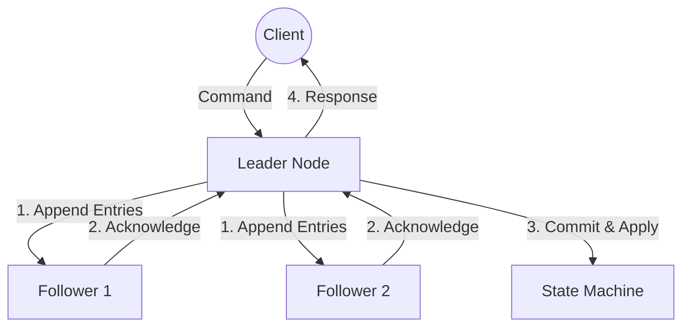
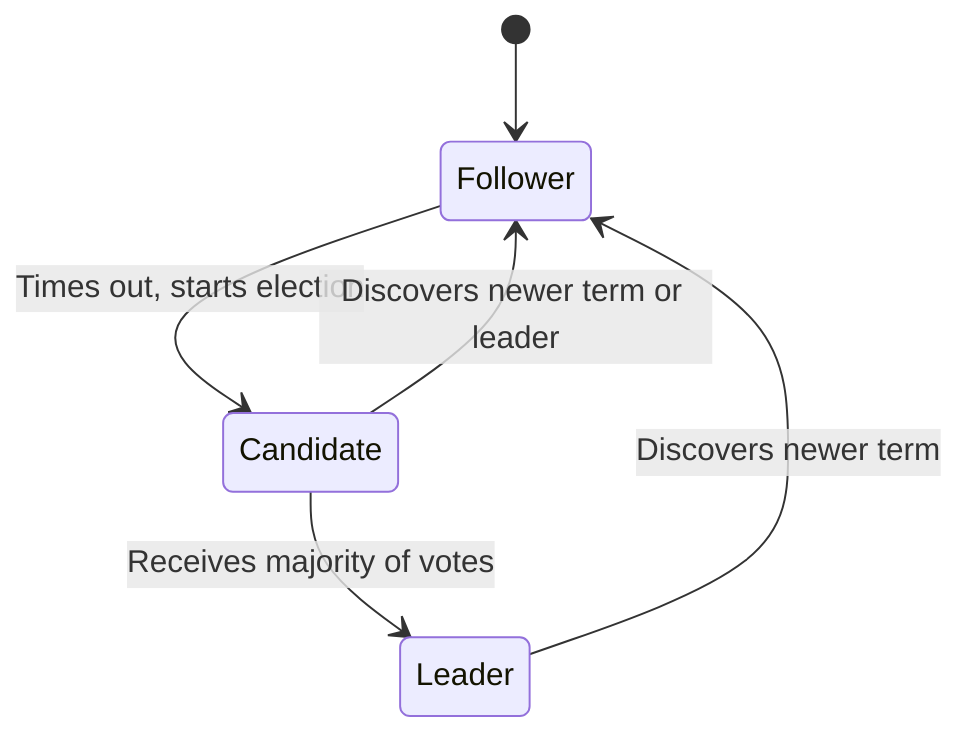
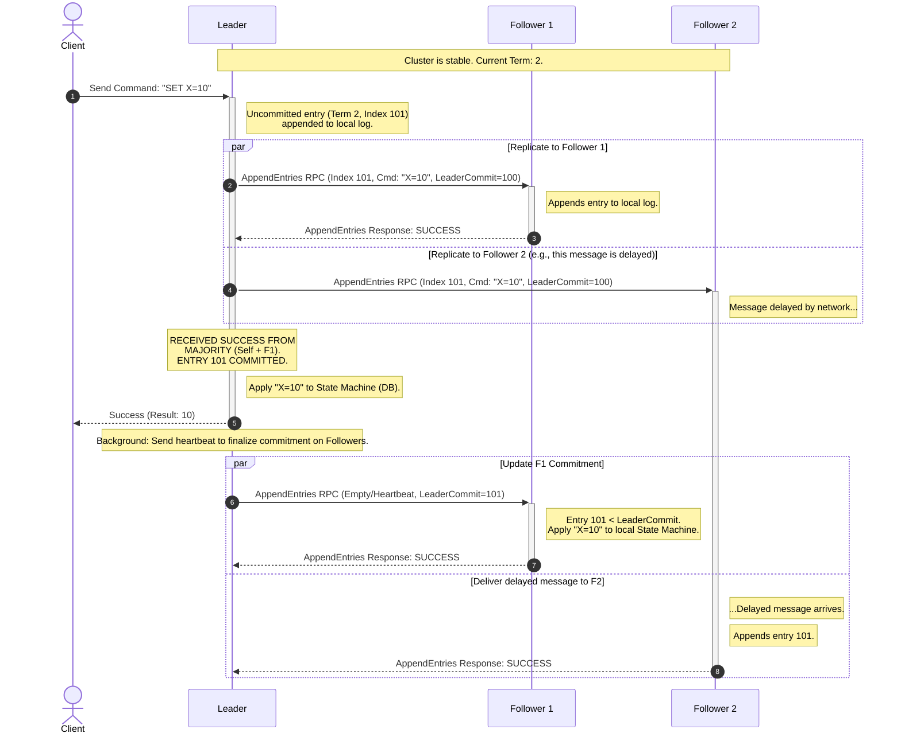

# Raft
Raft is a consensus algorithm designed to be easy to understand. It ensures that a cluster of machines can agree on a series of values (a log) even if some of the machines fail.

It operates on a "Leader-Follower" model where one node takes the reins, and the others replicate its state.

## High-Level Architecture
The system is built on a Replicated State Machine (RSM) architecture. The goal is to keep the State Machine (your database or service) identical across all nodes.

## The Node State Machine
Every node in the cluster exists in one of three states. Most of the time, there is one Leader and everyone else is a Follower.

**Follower**: Passive; only responds to requests from Leaders/Candidates.

**Candidate**: Active; used to elect a new leader.

**Leader**: Handles all client requests and manages log replication.

## Leader Election (The Heartbeat)
Raft uses Terms (logical clocks) to detect stale information.
* Timeout: If a Follower doesn't hear from a Leader for a random period (e.g., 150ms–300ms), it becomes a Candidate.
* Request Vote: The Candidate increments its Term and asks other nodes for votes.
* Majority: If it gets votes from a majority ($N/2 + 1$), it becomes the Leader.
* Heartbeats: The new Leader immediately sends "empty" AppendEntries calls to prevent others from timing out.

## Log Replication (The Workhorse)
Once a leader is elected, it manages the log. This is how the "Consensus" actually happens.

* **Client Request**: A client sends a command (e.g., SET X=10) to the Leader.

* **Local Append**: The Leader adds the command to its own log.

* **Replication**: The Leader sends AppendEntries RPCs to all Followers.

* **Commitment**: Once the Leader receives a "success" from a majority of Followers, it considers the entry committed.

* **Application**: The Leader applies the entry to its local State Machine and notifies Followers to do the same in the next heartbeat.

## Safety & Consistency
Raft ensures that if any node has applied a log entry to its state machine, no other node can ever apply a different command for that same index.

**Election Restriction**: A Candidate cannot win an election unless its log is "at least as up-to-date" as a majority of the cluster. This prevents a node that was offline from becoming leader and wiping out valid history.

**Log Matching Property**: If two logs contain an entry with the same index and term, then the logs are identical through that index.

## Summary
| Phase | Action |
|---|---|
| Normal | OpLeader receives client request $\rightarrow$ replicates to followers $\rightarrow$ commits $\rightarrow$ responds. |
| Failure | Leader dies $\rightarrow$ Followers time out $\rightarrow$ Election starts $\rightarrow$ New Leader emerges. |
| Recovery |Old Leader comes back $\rightarrow$ Sees higher Term $\rightarrow$ Steps down to Follower $\rightarrow$ Syncs log. |

# Sequence Diagram

Steps 2 & 3: Parallelism. The leader is responsible for notifying all followers in parallel. It does not wait for all of them; it only waits for a majority.

Step 4: Commitment Point. This is the moment consensus is achieved. The "Commit Index" advances on the Leader. Once committed, this entry is durable and cannot be lost.

Step 5: Rapid Response. The leader responds to the client immediately after the majority responds, before the remaining followers even know the entry is committed (as seen in Step 6, F2 is still catching up).

Step 6: Delayed Application. The next AppendEntries (which might be an empty heartbeat) is used to inform the Followers of the new Commit Index, allowing them to finally apply the change to their own state machines.