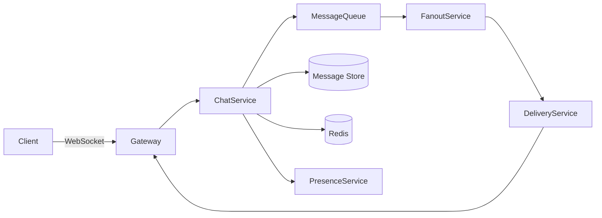
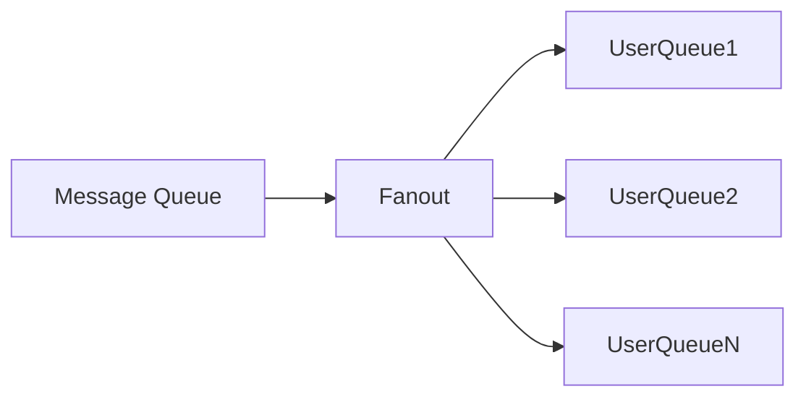
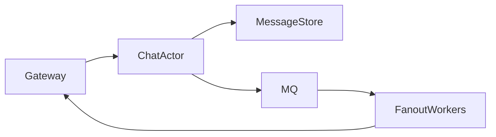
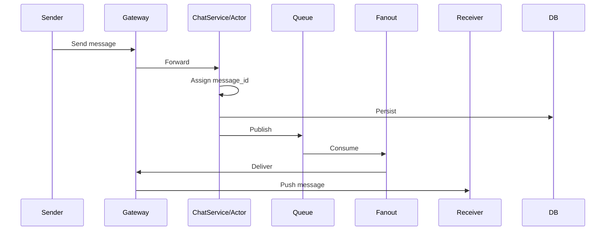
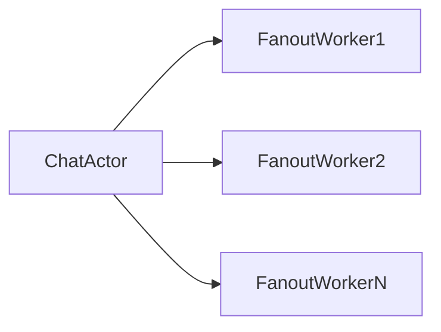
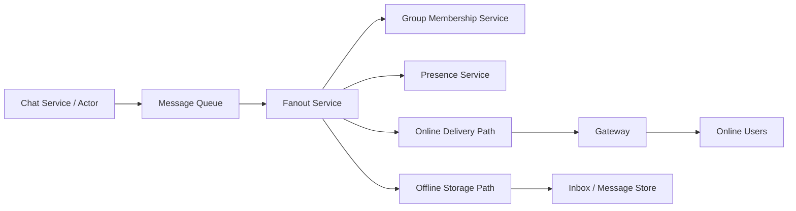
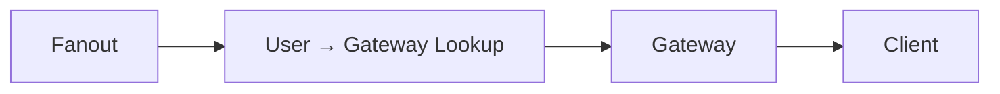

# Group Chat
## Assumptions
* Large-scale system (WhatsApp/Slack-like)
* Groups up to 10k users
* Strong ordering within a conversation
* At-least-once delivery
* Low latency (<200ms)
## High Level Architecture


## Gateway Layer (Connection Manager)
Ingress layer
### Responsibilities:
* Maintain persistent connections (WebSockets)
* Handle auth/session
* Route messages to backend
* TLS termination
* DDos Protection

### Key Design Choices:
* Stateless (store connection mapping externally)
* Use consistent hashing → user → gateway node

### Scaling:
* Horizontal scaling
* Thousands of connections per node

Use something like:
ELB / Envoy / Nginx

## Chat Service (Core Logic)
This is your write path brain.
### Responsibilities:
* Validate message
* Assign message ID (ordering!)
* Persist message
* Push to queue

> Important: Ordering

### For each conversation:
* Use a monotonic sequence ID
Option:
* DB auto-increment per chat
* Or distributed ID generator (e.g., Snowflake with partitioning)

## Message Queue
* Decouple write from fanout
* Handle spikes
### Options:
* Kafka (ideal for ordering + replay)
* Pulsar / Kinesis
### Partitioning strategy:
* Partition by chat_id → ensures ordering

## Fanout Service
This is where group chat becomes tricky.

### Two models:
**Fanout-on-write (most common)**

When message arrives → push to all recipients

**Fanout-on-read**
Store once, compute recipients at read time

> For large-scale chat → fanout-on-write

### Flow


## Delivery Service
### Responsibilities:
* Deliver messages to online users
* Retry for offline users
### Mechanism:
* Lookup: user → active gateway
* Push via WebSocket

## Presence Service
### Tracks:
* Online/offline
* Last seen
### Usually:
* Backed by Redis
* Updated via heartbeat

# Actor Model

## Responsibilities
Each actor handles:
* Message ordering
* Membership list
* Fanout triggering

## Actor Placement
Two approaches:
1. **In-memory actors (e.g., Akka / Orleans)**
* Fast
* Need persistence strategy
2. **Virtual actors (Orleans-style)**
* Automatically distributed
* Activated on demand

# End to End Flow

# Deep Dives
## Partitioning
Problem Statement: Ensuring message ordering and avoiding hot partitions

1. Ordering guarantee
* All messages in a chat must be strictly ordered
* Easiest way → single partition per chat_id
2. Throughput / scalability
* Large groups (10k–100k users) → huge fanout
* Single partition becomes a hotspot

### Solution
Instead of sharding the partition, shard fan out

## Fanout strategy


### Message arrives at Chat Service / Actor
* Validates message
* Assigns message_id
* Stores it (durability)
* Publishes ONE event to queue:
```json
{
  "chat_id": "123",
  "message_id": "456",
  "sender_id": "userA",
  "payload": "Hello"
}
```

### Fanout Service consumes the message
* Fetch group members from Group Membership Service (DB/cache)
* Split: Online vs Offline users
    * Fanout service queries:
        Presence Service (usually Redis)

#### Online Delivery Path

* Lookup: which gateway holds the user’s connection
* Push via WebSocket
* Done

#### Offline Delivery Path
```
flowchart LR
    Fanout --> Inbox[(Message Store)]
    Inbox --> LaterFetch[User fetches on reconnect]
```
* Don’t push immediately
* Just ensure message is in storage
* User will fetch later

### Offline Delivery Path storage
Deleting messages on read will cause tombstone explosion
Putting TTL on rows will reduce the issue but causes loss of messages
| Approach       | Pros                 | Cons              |
| -------------- | -------------------- | ----------------- |
| TTL on write   | Simple, auto cleanup | Data loss risk ❌  |
| No TTL         | Durable              | Storage growth    |
| Cold storage   | Scalable             | More complexity   |
| TTL after read | Ideal UX             | Hard to implement |


# Different Designs
| System Type | Backend Stores  | Client Role |
| ----------- | --------------- | ----------- |
| Old SMS     | Minimal         | Primary     |
| WhatsApp    | Medium + backup | Cache       |
| Slack       | Full history    | Thin client |


# Scaling
## Recommendation
* Set your Horizontal Pod Autoscaler (HPA) to trigger at 70% of Connection Capacity or 75% of Memory Limit.
    * Use "Step" Scaling (Avoid the Churn)
    * Don't scale 1 pod at a time. Scale in "chunks" (e.g., add 5 pods at once) and set a long Scale-down
    * Stabilization Window (e.g., 15–20 minutes). This ensures the cluster stays stable even if traffic fluctuates slightly.
* Implement "Connection Draining"
    * When scaling down, Kubernetes sends a SIGTERM. Your Go code must catch this:
    * Stop accepting new gRPC streams.
    * Send a GOAWAY frame to existing clients.
    * Wait 30–60 seconds for clients to move gracefully before the Pod actually dies.

