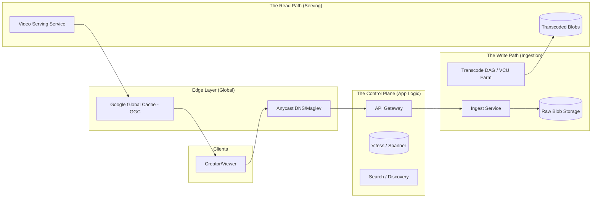
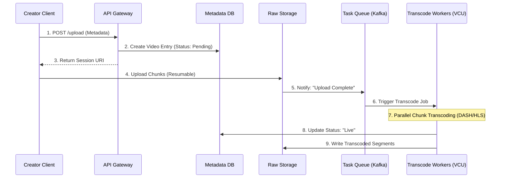
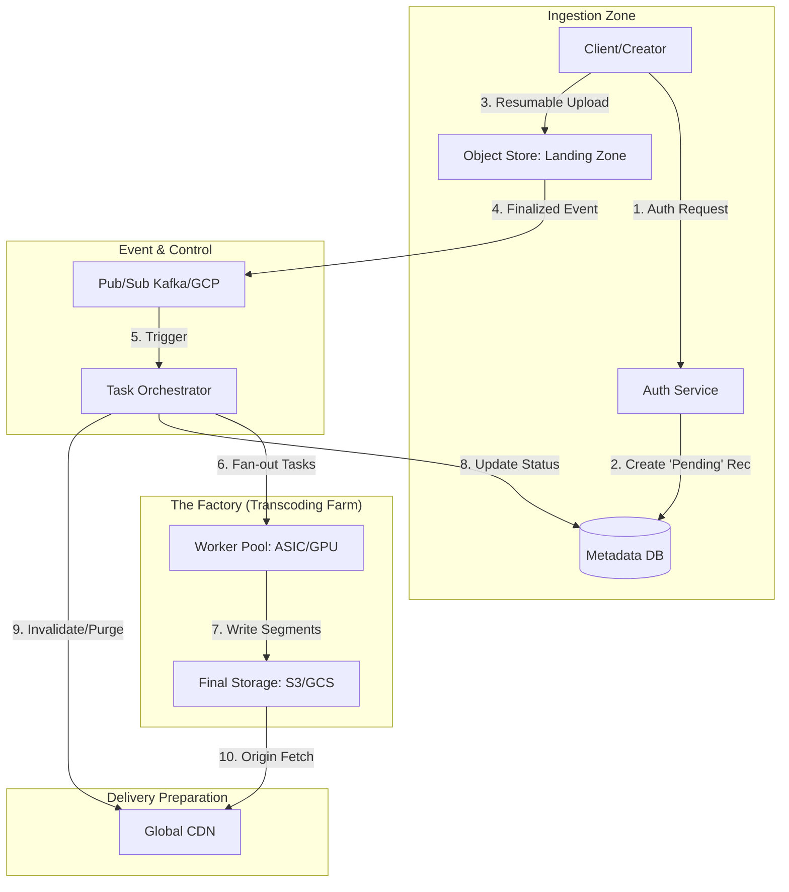
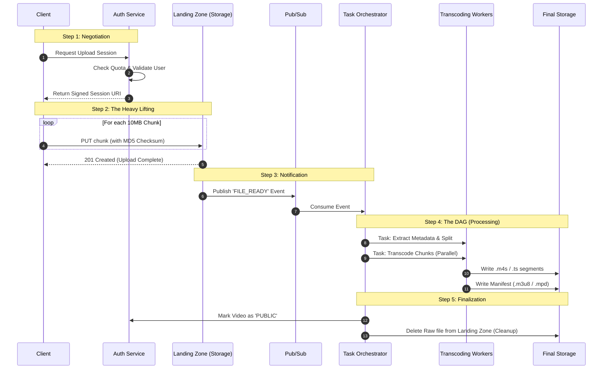
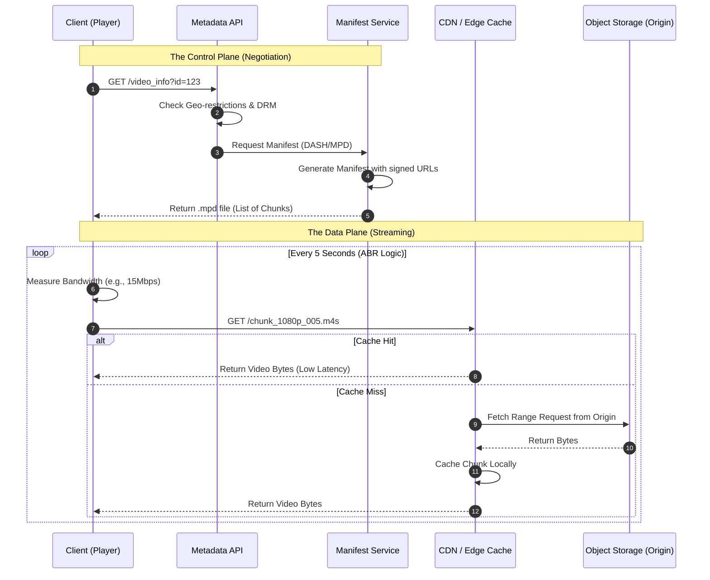

# Youtube
Goal: Design a youtube like video hosting platform handling billions of concurrent views.

## Focus
Can they handle petabyte-scale data and global distribution?

The "Thundering Herd" Problem: "Imagine we have a globally anticipated video premiere (like a MrBeast drop or a World Cup final). Walk me through how you’d architect the infrastructure to handle 10M+ concurrent viewers hitting the 'Play' button at the exact same second without a cache stampede."

Storage Strategy: "YouTube handles a massive spectrum of data—from 'hot' viral hits to 'cold' videos from 2007. How would you design a multi-tiered storage strategy that optimizes for both latency and cost-efficiency?"

Global Traffic: "How do you approach Global Load Balancing (GLB) and Anycast to ensure a viewer in Tokyo and a viewer in New York have the same sub-100ms time-to-first-byte?"

# High-Scale Architecture
Break the system into two massive flows:

The Read Path (Viewing): Client → CDN → Load Balancer → Video Service → Distributed Storage.

The Write Path (Uploading): Client → API Gateway → Transcoding Pipeline → Blob Storage (S3/GCS) → Metadata DB (Bigtable/Spanner).



## Transcoding Pipeline


**Chunking**: Break videos into 2–5 second chunks.

**Parallelism**: Use a DAG (Directed Acyclic Graph) to process chunks simultaneously across thousands of workers.

**Prioritization**: New videos from "Mister Beast" get transcoded faster than a video with 0 subscribers.

## The Video Delivery (Edge Computing)
CDN Strategy: Don't just say "use a CDN." Talk about ISP PoPs (Points of Presence). YouTube places hardware inside ISP data centers (Google Global Cache) to reduce backhaul costs.

Adaptive Bitrate Streaming (ABR): Mention protocols like DASH or HLS. The client switches between 1080p and 480p automatically based on network congestion.

## Database Architecture (Metadata vs. Video)
Video Blobs: Use an Object Store (like GCS or an internal equivalent).

Metadata: Use a wide-column store like Bigtable or a horizontally sharded Vitess/MySQL setup for high-speed lookups of titles, descriptions, and user data.

View Counts: Explain why this is hard. Use an Eventual Consistency model with a distributed counter (e.g., Redis or an in-memory aggregator) to prevent DB thrashing.

## Reliability Concerns
Multi-Region Failover: "If US-East-1 goes down, how do we redirect traffic without blowing up the origin?"

Cost Optimization: "How do we decide when to delete old, zero-view videos or move them to Cold Storage (Tape/Glacier)?"

Observability: "How do we track 'Rebuffer Rate' globally to catch ISP-specific routing issues?"

# Ingestion & Trascoding 
## Upload
When a creator hits "Upload," the system triggers a complex DAG (Directed Acyclic Graph) of microservices.

Resumable Uploads: YouTube uses a chunked upload protocol (via Google Front End). If the connection drops at 90%, the client queries the server for the last byte received and resumes from there.

The VCU (Video Transcoding Unit): This is the "Staff level" secret. At this scale, CPUs are too slow and expensive. Google built custom ASIC chips (VCUs) designed solely for transcoding.

One 4K upload is split into thousands of small chunks.

These chunks are sent to a pool of VCU-accelerated workers that transcode them into every resolution (144p to 8K) and codec (H.264, VP9, AV1) simultaneously.

DAG Orchestration: A central job manager ensures that "most-used-qualirt" versions (720p/1080p) are finished first so the video can go live quickly, while 4K/8K versions are processed in the background.

## Ingestion

### Step A: The Encoding & Segmentation
The raw video is encoded into multiple versions with different resolutions and bitrates (e.g., 1080p at 5Mbps, 720p at 2Mbps, 480p at 800Kbps).
* Segments: Each version is sliced into small chunks.
* Alignment: Crucially, the "cuts" happen at the exact same timestamp across all versions. This allows a player to swap from 1080p Segment #5 to 720p Segment #6 seamlessly.

### Step B: The Manifest (The "Map")
The server creates a text file that acts as an index.
* HLS uses .m3u8 files (Playlists).
* DASH uses .mpd files (Media Presentation Description).
    * These files tell the player: "Here are the available bitrates, and here are the URLs for every single segment."



### HLS (HTTP live streaming)
Developed by Apple (Used in all apple devices)It breaks the video into segments (often .ts files) and creates a Manifest file (.m3u8). The manifest acts like a "table of contents" telling the player where to find the chunks for 480p, 720p, and 1080p.

### DASH (Dynamic Adaptive Streaming over HTTP)
Similar to HLS, it uses a manifest file called an MPD (Media Presentation Description). It is codec-agnostic, meaning it can use H.264, H.265 (HEVC), VP9, or AV1.

| Feature | HLS | DASH |
|---|---|---|
| Origin | Apple | MPEG (International Standard)|
| Format | ".m3u8 (Manifest) | .ts or .mp4",".mpd (Manifest), usually .mp4" |
| Device Support | Everywhere (iOS/Android/Web) | "Android, Windows, Smart TVs (No native iOS)" |
| YouTube Usage | Backup / Legacy | Primary Protocol |

## Media Packager
In a standard professional workflow, the packager takes the raw bitstreams from the encoder and performs two main tasks:
* Multiplexing: It wraps the video/audio into a "container" (like fMP4 or MPEG-TS).
* Manifest Writing: It creates the text-based manifest. It records exactly where each segment starts, its duration, and its URL.

Common Tools:
* Software-based: FFmpeg (can encode and package simultaneously), GPAC/MP4Box, Shaka Packager.
* Cloud Services: AWS Elemental MediaPackage, Bitmovin, or Azure Media Services.

Static vs. Dynamic Generation
The "who" and "when" changes based on whether the content is a pre-recorded movie or a live broadcast.
VOD (Video on Demand)
* When: Generated once during the "ingest" or upload process.
* Process: The packager scans the entire video file, creates all segments, and saves a static manifest file to a server (like Amazon S3). It never changes unless the video is deleted.
Live Streaming
* When: Generated continuously in real-time.
* Process: As the live camera feed comes in, the packager creates a new segment every few seconds and appends a new line to the manifest. The player refreshes this file every few seconds to see if a new "chapter" has been added to the story.

## Manifest Personalization (The "On-the-Fly" Layer)
Sometimes, the metadata is modified after the packager creates it. This is usually done by a Manifest Manipulator at the edge of the network (near the user).
* Ad Insertion: A service like AWS MediaTailor intercepts the manifest and swaps out a "content" segment URL for an "advertisement" segment URL.
* Device Targeting: If a user is on a slow 3G connection, an edge server might rewrite the manifest to remove the 4K options entirely to prevent the player from even trying to load them.

| Role | Responsibility |
|---|---|
| Encoder |	Turns raw pixels into compressed data ($H.264$, $HEVC$). |
| Packager | Cuts data into segments and writes the initial manifest. |
| Origin Server | Stores and serves the manifest and segments. |
| Manipulator | (Optional) Edits the manifest for ads or localization. |

# Global Delivery Network
```mermaid
graph TD
    subgraph "The User's Device"
        Client[Mobile/Web Player]
    end

    subgraph "Level 1: The ISP Edge (GGC)"
        GGC[Google Global Cache - ISP Racks]
    end

    subgraph "Level 2: The Regional PoP"
        Anycast[Anycast DNS / Maglev LB]
        EdgeCache[Edge Cache Node]
    end

    subgraph "Level 3: The Control Plane (Google Cloud)"
        API[Video Metadata API]
        Manifest[Manifest Generator]
        Auth[Auth / DRM Service]
    end

    subgraph "Level 4: The Origin (Source of Truth)"
        ObjectStore[(Global Object Storage)]
    end

    Client -->|1. Get Metadata| API
    API -->|2. Get Session/Auth| Auth
    API -->|3. Generate Custom Manifest| Manifest
    Manifest -->> Client
    
    Client -->|4. Request Chunk| GGC
    GGC -.->|Cache Miss| EdgeCache
    EdgeCache -.->|Cache Miss| ObjectStore
    ObjectStore -->|Stream Byte Range| EdgeCache
    EdgeCache -->|Stream| GGC
    GGC -->|Stream| Client
```
This is where the DASH/HLS protocols you asked about come into play.Google Global Cache (GGC): This is YouTube's "Edge."

Google literally ships physical servers to ISPs (like Comcast or Airtel).90% Cache Hit Rate: If a video is popular in London, it is stored inside the London ISP’s data center.

Your request never even leaves your provider's network.Hierarchical Caching: 
1.  L1 (GGC): Deep inside the ISP (closest to you).
2.  L2 (Edge PoP): Google's own regional data centers.
3.  L3 (Origin): Google Cloud Storage (the source of truth)

**Maglev & Anycast**: 
* YouTube uses Anycast IP routing. 
* Multiple servers around the world share the same IP address. 
* Maglev (Google’s distributed load balancer) then routes your packet to the "closest" healthy server in less than a millisecond.

## How the Player "Decides" (The ABR Logic)

The "magic" of DASH and HLS happens in the Client-Side Player logic:

**The Fetch**: The player first downloads the Manifest File (DASH .mpd or HLS .m3u8).

**The Throughput Estimation**: The player measures how long the last 5-second chunk took to download.

**The Switch**: 
* If your speed is 20Mbps, it asks the manifest for the 1080p_chunk_6.ts.
* If your speed drops to 2Mbps (you entered an elevator), it immediately asks for 480p_chunk_7.ts.
> Because the chunks are IDR-aligned (they all start with the same frame), the switch is seamless to the viewer.

### The Math of Adaptation
The player uses a Buffer-Based or Rate-Based algorithm to decide which segment to fetch. Internally, it calculates the throughput T:
```
T = Segment Size (bits)/Download Time (seconds)
```
If T is significantly higher than the bitrate of the next tier, the player "up-switches" to better quality.

### Why "Low Latency" Matters
Standard DASH and HLS often have a 10–30 second delay because the player wants to keep a few segments in the "bank" (buffer).

LL-HLS and LL-DASH reduce this by breaking segments into even smaller "parts" or "chunks." The player can start playing a 6-second segment while it’s still being uploaded to the server, rather than waiting for the full 6 seconds to finish.

The metadata (the .m3u8 or .mpd files) is generated by a component called the Packager (or Segmenter).

While the Encoder is responsible for the heavy lifting of shrinking the video, the Packager is the librarian that organizes those pieces and writes the index.

# The Data Layer
Metadata: YouTube uses Vitess (a database clustering system for MySQL) to handle billions of comments and likes.

Discovery: A separate Vector Database and Neural Network (built on TPUs) calculate your recommendations in real-time, feeding the "Up Next" IDs to the video service.

> In a system design interview for YouTube, you wouldn't just pick one. You’d explain the Hybrid Strategy:

**Storage Efficiency**: You store the video chunks in a neutral format (like CMAF—Common Media Application Format).

**On-the-Fly Packaging**: When a request comes in, your edge servers "wrap" those CMAF chunks into either an HLS manifest (for an iPhone user) or a DASH manifest (for a Chrome user).

**Adaptive Logic**: You’d discuss how the client-side player monitors the TCP throughput and Buffer Health. If the buffer drops below 5 seconds, the player automatically requests the next chunk from the 480p manifest instead of the 1080p one to prevent "buffering" circles.

**Staff-level nuance**: Ask about DRM (Digital Rights Management). HLS usually pairs with Apple FairPlay, while DASH usually pairs with Google Widevine.

